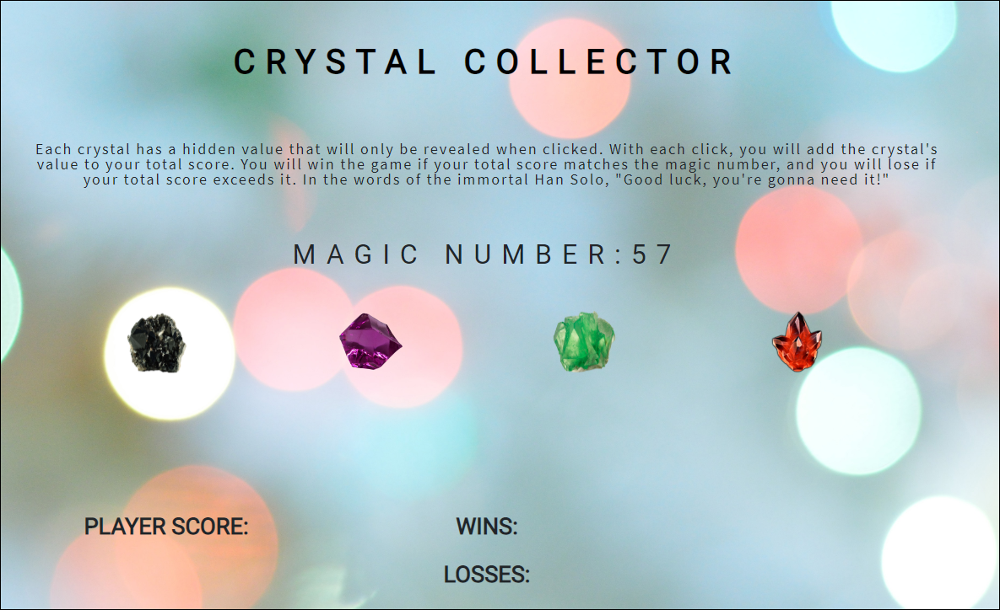

# Crystal Collector Game - Unit 4

## Rules of the Game
1. There are 4 Crystals displayed on the page.
2. You will be shown a random (magic) number at the start of the game.
3. When you click on a crystal, it will add a specific amount of points to your total score.
4. You win if your total score matches the magic number from the beginning of the game.
5. Conversely, you lose if your score goes above the magic number.
6. The game will restart with a new magic number and your score goes back to zero whenever you win or lose.

## Code
This game was built using jQuery with the purpose of defining variables and declaring functions.

## Screenshot

